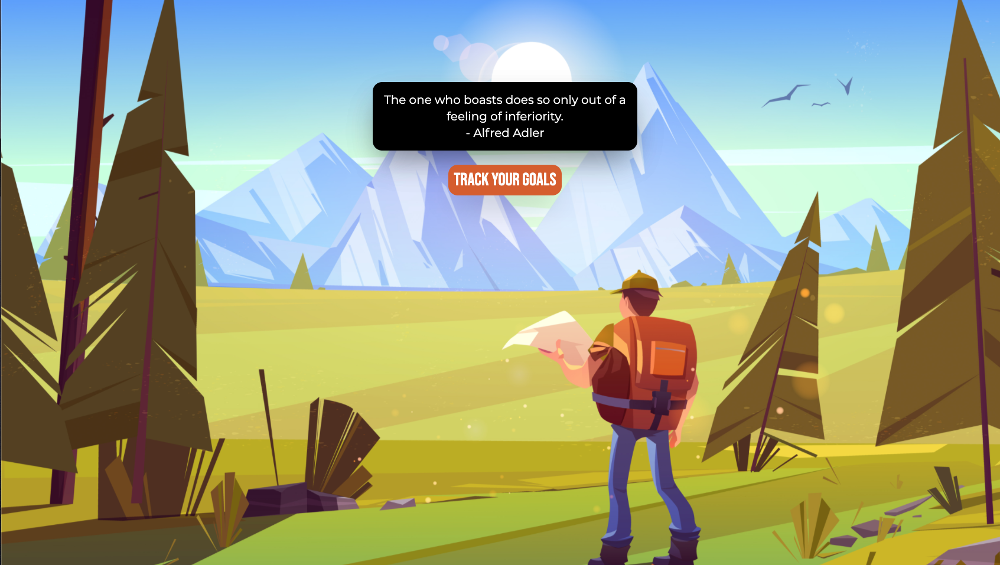
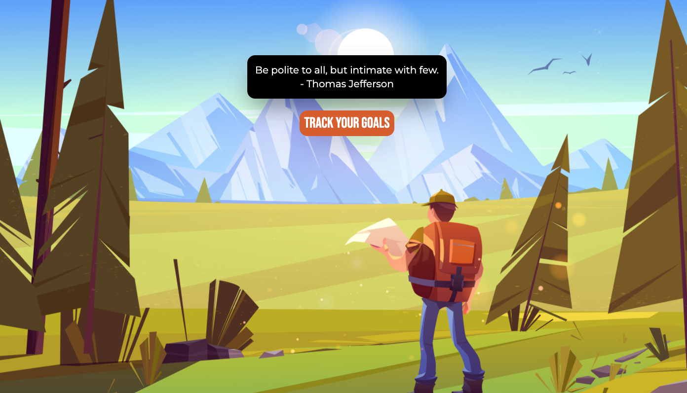
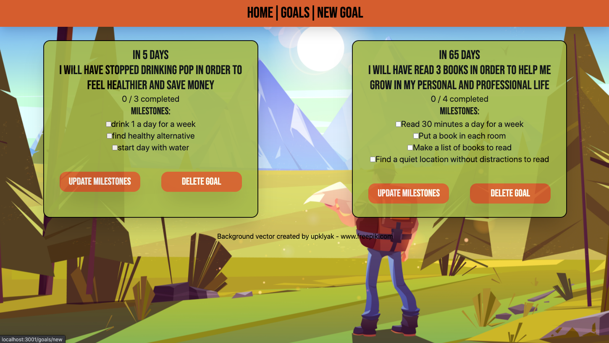
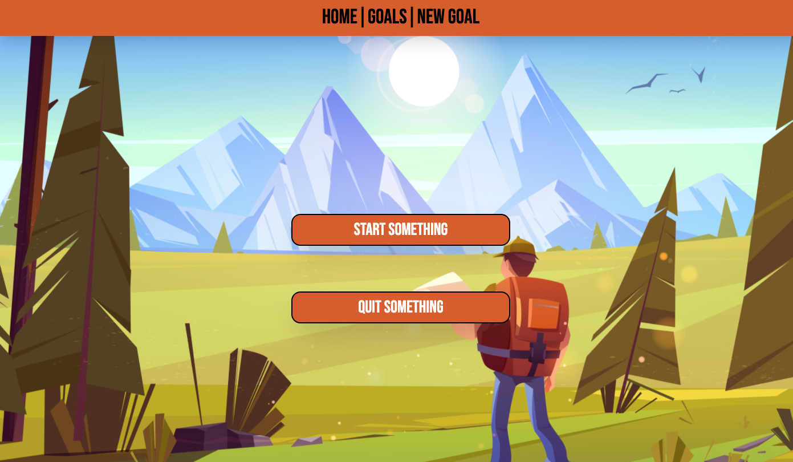
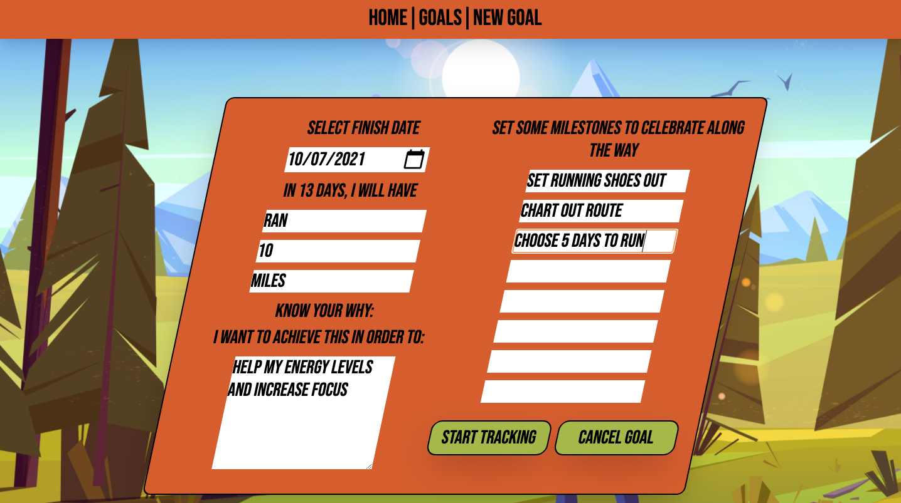

# Achieve

This application was built for people who struggle with accomplishing their goals. It walks them through each step of creating a S.M.A.R.T goal and allows them to track their progress along the way. 

## Installation

To view the site, both the backend and frontend will need set up
  
1) Set up backend:
  * Clone the [achieve_backend repo](https://github.com/ericlombardo/achieve_backend) using the link in the top right corner
  * Run `git clone <paste_clone_link>` in desired directory
  * Navigate inside the directory and run:
    * `bundle install` 
    * `rails db:migrate`
    * `rails db:seed`
    * `rails s` to start server
  * Once you see server is running, backend setup is complete (leave this terminal open)

2) Set up frontend:
  * Clone the [achieve_client repo](https://github.com/ericlombardo/achieve_client) using the link in the top right corner
  * Run `git clone <paste_clone_link>` in desired directory
  * Navigate into the cloned directory
  * Run `npm install` to download all dependencies for the application
  * Run `npm start` to launch the page and start tracking your goals
    * NOTE: When running `npm start` it may alert you that you are already using localhost3000. That is what your backend Rails API is using. You should be prompted to use a different port. Press Y to continue using localhost3001.

## Build Status
While the application is functional for personal use, it is still in the development phase. I would like to add a feature that allows multiple users to log in securely and track their goals. Other features would include reminders of goal deadlines and the ability to give encouragment as they achieve each of their milestones.

## Usage

Once you start the application you are taken to a home screen where you are welcomed with a quote and promted to start tracking your goals.

You are then taken to the goals page where you can see each goal with it's designated milestones. Each goal displays how many days are left before you are to complete the goal and they are sorted to show you the goals you want to complete soonest.

If you click the New Goal tab in the navbar you are prompted to select if you would like to start or quit something

Once you select your choice, you are then taken to the proper form. You can fill out the form and submit it to start tracking your goal. You are then taken back to the main goals page where you will see your new goal being tracked.

## Contributing

Bug reports and pull requests are welcome on GitHub at https://github.com/ericlombardo/achieve_backend. 
Please review the [Contributing Guidelines](https://github.com/ericlombardo/achieve_backend/blob/master/CONTRIBUTING.md) to make sure everyone is following the proper formating.

## Code of Conduct

Everyone interacting in the Achieve project's codebases, issue trackers, chat rooms and mailing lists is expected to follow the [code of conduct](https://github.com/ericlombardo/achieve_backend/blob/master/CODE_OF_CONDUCT.md).

